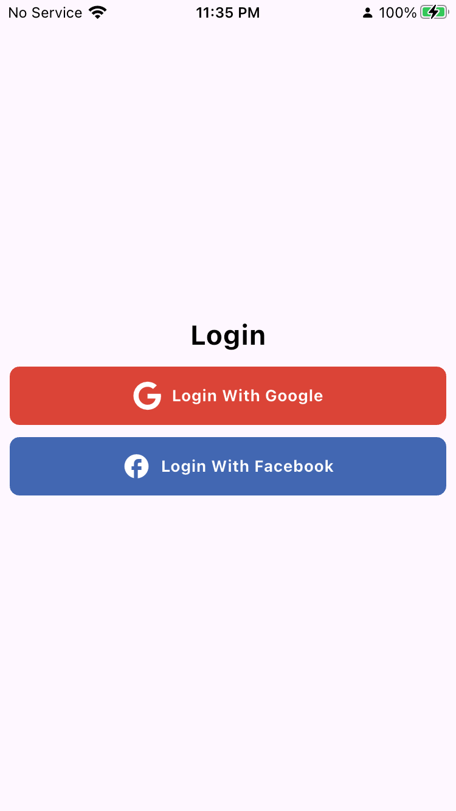
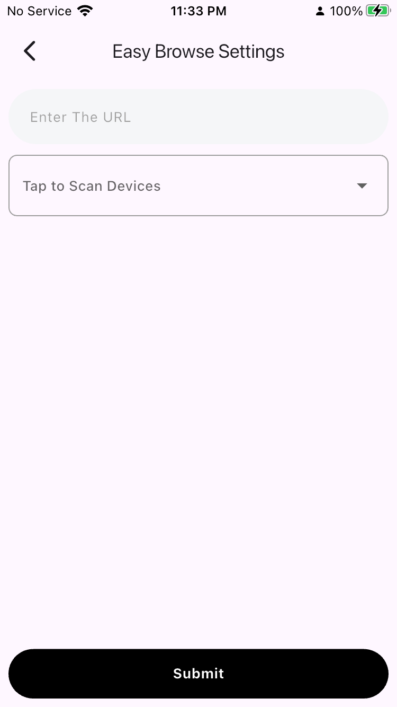
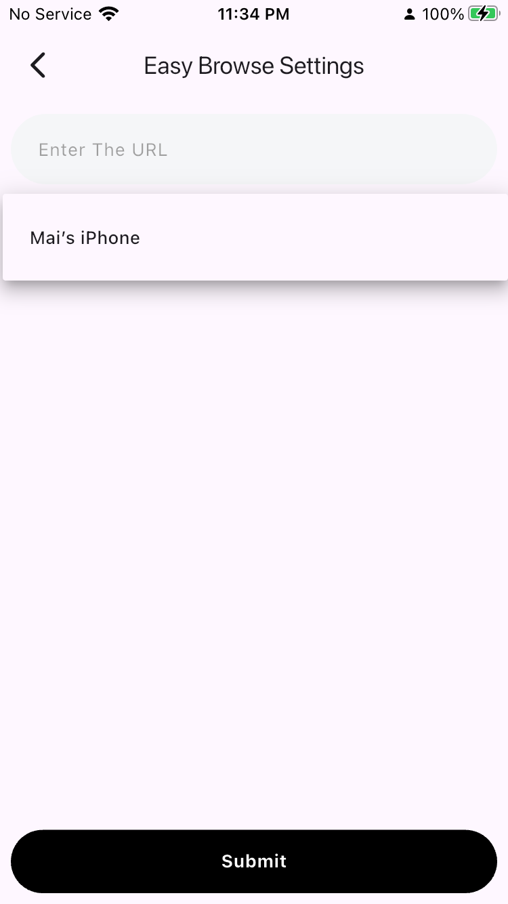

# Easy Browse

A cross-platform Flutter application for browsing and discovering network devices and web content with integrated social authentication and modular architecture.

Key highlights:
- Cross-platform Flutter app (Android, iOS, web, desktop-ready)
- Social authentication and Firebase integration
- Dynamic WebView for in-app browsing
- Local network device discovery utilities
- Clean Architecture and Cubit for state management

---

## Table of Contents

- [Demo & Screenshots](#demo--screenshots)
- [Features](#features)
- [Tech Stack](#tech-stack)
- [Prerequisites](#prerequisites)
- [Installation](#installation)
- [Configuration (Firebase & Platform)](#configuration-firebase--platform)
- [Running the app](#running-the-app)
- [Testing](#testing)
- [Project Structure](#project-structure)
- [Contributing](#contributing)
- [License](#license)
- [Maintainers / Contact](#maintainers--contact)

---

## Demo & Screenshots

Add screenshots or a short demo GIF here to make the repository more attractive. Example:






Tip: place images under `docs/screenshots/` and reference them above.

## Features

- User authentication (Firebase / social providers)
- Dynamic WebView to load and interact with remote pages
- Local network discovery to find devices/services on the same LAN
- Clean Architecture separation (core, features, data, presentation)
- Cubit (Bloc) for predictable state management

## Tech Stack

- Flutter & Dart
- Firebase (Auth, Firestore / optional services)
- Cubit (Bloc) for state management
- Platform-specific integrations (iOS/Android native configs)

## Prerequisites

- Flutter SDK (stable channel) — install from https://flutter.dev
- Android SDK + Android Studio (for Android development)
- Xcode & CocoaPods (for iOS development on macOS)
- Optionally: `flutterfire` CLI if you want to generate `firebase_options.dart`

macOS users: ensure `pod` is available and up-to-date. Example:

```bash
gem install cocoapods
pod setup
```

## Installation

1. Clone the repository

```bash
git clone https://github.com/mai-alaa/Easy-Browse.git
cd Easy-Browse
```

2. Get Dart/Flutter packages

```bash
flutter pub get
```

3. iOS (macOS only): install CocoaPods dependencies

```bash
cd ios
pod install --repo-update
cd ..
```

## Configuration (Firebase & Platform)

This project includes `lib/firebase_options.dart` (generated by FlutterFire). If you need to reconfigure Firebase for your own project:

1. Install the `flutterfire` CLI: `dart pub global activate flutterfire_cli`
2. Run `flutterfire configure` and follow the prompts — this will generate a new `firebase_options.dart`.

Platform-specific files you may need to provide or replace for your Firebase project:
- Android: `android/app/google-services.json`
- iOS: `ios/Runner/GoogleService-Info.plist`

Place these files in the respective platform folders before running the app on a device or simulator.

## Running the app

- Run on the default connected device/emulator:

```bash
flutter run
```

- Run on a specific device (list devices first):

```bash
flutter devices
flutter run -d <device-id>
```

- Build release artifacts:

```bash
flutter build apk         # Android
flutter build ios --no-codesign  # iOS (macOS)
```

## Testing

Run unit and widget tests with:

```bash
flutter test
```

There is a sample widget test in `test/widget_test.dart`.

## Project Structure (high-level)

- `lib/` — main Dart code
	- `core/` — shared utilities and base classes
	- `features/` — feature modules (login, settings, browsing)
	- `config/` — routing and app configuration
	- `firebase_options.dart` — generated Firebase settings

- `ios/`, `android/`, `web/` — platform folders and configurations

## Contributing

Contributions are welcome!

- Open an issue to discuss large changes before implementing
- Fork the repo, create a feature branch, and submit a pull request
- Follow existing code style and include tests where applicable

## License

No `LICENSE` file was found in the repository. Add a license file (for example, `MIT`) if you intend to allow reuse. Until a LICENSE is added, the repository has no explicit open-source license.

## Maintainers / Contact

- Maintainer: `mai-alaa` (GitHub: https://github.com/mai-alaa)

---

If you'd like, I can:
- add example screenshots under `docs/screenshots/` and wire them into the README
- add a recommended `LICENSE` (MIT) and create the `LICENSE` file
- create a short contributing guide `CONTRIBUTING.md`

Thank you for building Easy Browse — let me know what to add next!
